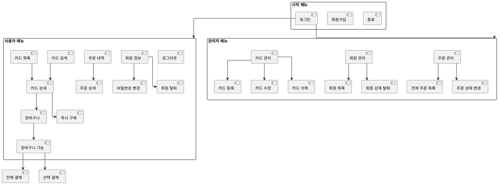

## 📚 목차

1. [🧠 프로젝트 주제 선정 이유 및 차별점](#-프로젝트-주제-선정-이유-및-차별점)  
2. [⚙️ 개발 환경 및 기술 스택](#-개발-환경-및-기술-스택)  
3. [📁 패키지 구조 요약](#-패키지-구조-요약)  
4. [✅ 요구사항 정의서](#-요구사항-정의서)  
5. [📝 요구사항 명세서](#-요구사항-명세서)  
6. [🔐 비기능 요구사항 명세서](#-비기능-요구사항-명세서)  
7. [📦 주요 기능 상세 분석](#-주요-기능-상세-분석)  
   - 7-1. [👤 사용자 기능](#-사용자-기능)  
   - 7-2. [🃏 카드 기능](#-카드-기능)  
   - 7-3. [🛒 장바구니 기능](#-장바구니-기능)  
   - 7-4. [📦 주문 기능](#-주문-기능)  
   - 7-5. [🛠 관리자 기능](#-관리자-기능)  
8. [🧬 클래스 다이어그램](#-클래스-다이어그램)  
   - 8-1. [🃏 카드 구조](#-카드-구조) 
   - 8-2. [📦 주문 구조](#-주문-구조)  
   - 8-3. [👤 회원 구조](#-회원-구조)  
   - 8-4. [🛒 장바구니 구조](#-장바구니-구조)  
   - 8-5. [🛠 관리자 서버 구조](#-관리자-서버-구조)  
10. [🎮 유스케이스 다이어그램](#-유스케이스-다이어그램)  
11. [🧪 작동 시나리오](#-작동-시나리오)  
12. [🎥 프로젝트 시연 영상](#-프로젝트-시연-영상)  
13. [💬 프로젝트 회고](#-프로젝트-회고)


## 🧠 프로젝트 주제 선정 이유 및 차별점

### 🎯 프로젝트 목적

- **실제 존재하는 수집 시장**을 기반으로 한 구조 설계 훈련  
- **VO / DAO / Service 계층 분리**를 통한 아키텍처 구현 능력 강화  
- 사용자 흐름, 관리자 통제, 조건 검색 등 **현실적인 시나리오 반영**

### 📈 스포츠 카드 시장 분석

- 글로벌 카드 거래 시장은 2022년 기준 약 1억 3,230만 달러  
- 2031년까지 약 4억 달러 규모 성장 전망  
- 투자, 수집, 커뮤니티 등 다양한 활용 분야 존재

### 🧍 사용자 페르소나 기반 기능 설계

| 이름 | 연령대 | 특징 및 니즈 |
|------|--------|---------------|
| 김OO (20대 수집가) | 빠른 키워드 검색, 간편 결제, 새 카드 정보에 민감 |
| 이OO (40대 투자자) | 등급 정보 중시, 카드 상세 스펙 중요, 장기 투자 관점 |

## ⚙️ 개발 환경 및 기술 스택

### 💻 개발 언어 및 환경

- **Language**: Java 17+
- **IDE**: Eclipse (또는 IntelliJ)
- **실행 방식**: CLI(Console) 기반

### 📁 패키지 구조 요약
```text
src/
├── card/                카드 정보 VO, DAO, Service
│   ├── CardVO.java
│   ├── CardDAO.java
│   ├── CardService.java
│   └── file/
│       └── ObjFileHashMapCardDAO.java
│
├── cart/                장바구니 관련 구조
│   ├── CartItemVO.java
│   ├── CartDAO.java
│   ├── CartService.java
│   └── CartServiceImpl.java
│
├── order/               주문 처리 DAO, VO, Service
│   ├── OrderVO.java
│   ├── OrderDAO.java
│   └── OrderService.java
│
├── user/                회원 정보 및 인증 로직
│   ├── Member.java
│   ├── MemberDAO.java
│   ├── MemberService.java
│   └── file/
│       └── ObjFileHashMapMemberDAO.java
│
├── admin/               관리자 서비스 및 인터페이스
│   ├── AdminService.java
│   └── DHAdminService.java
│
└── app/                 실행 진입점
    └── MainApplication.java
```


## ✅ 요구사항 정의서


## 📝 요구사항 명세서


## 🔐 비기능 요구사항 명세서


## 📦 주요 기능 상세 분석

요구사항 정의서 기반으로, 전 기능을 간단하게 분류하여 정리합니다.  
각 기능은 실제 구현된 메서드 또는 서비스 호출 흐름을 기준으로 요약됩니다.

---

### 👤 사용자 기능

- **회원가입**: ID 중복 체크 후 가입 (`join()`)
- **로그인**: ID/PW 확인 후 역할 분기 (`login()`)
- **회원 정보 확인**: 로그인 후 내 정보 출력
- **비밀번호 변경**: 기존 PW 확인 후 수정 (`updateInfo()`)
- **회원 탈퇴**: 확인 후 회원 데이터 삭제 (`withdraw()`)

---

### 🃏 카드 기능

- **카드 등록**: 관리자만 등록 가능 (`registerCard()`)
- **전체 카드 목록 조회**: 모든 카드 조회 (`getAllCards()`)
- **카드 키워드 검색**: 이름, 팀, 카테고리 포함 문자열 검색 (`searchCards()`)
- **카드 필터 검색**: 가격, 브랜드, 연도, 등급 조건 검색
- **인기 카드 보기**: 좋아요/판매수 높은 순 정렬
- **카드 주문하기**: 재고 차감 후 주문 처리 (`placeOrder()`)

---

### 🛒 장바구니 기능

- **장바구니 보기**: 사용자별 담긴 카드 목록 출력
- **카드 추가**: 수량 지정 후 장바구니 담기 (`addToCart()`)
- **전체 주문**: 장바구니 전체 결제 처리 (`checkoutAll()`)
- **비우기**: 장바구니 초기화
- **특정 카드 삭제**: 선택 카드만 장바구니에서 제거

---

### 📦 주문 기능

- **내 주문 목록 보기**: 사용자 ID 기준으로 주문 내역 출력
- **전체 주문 목록 조회**: 관리자 전용 전체 내역 확인
- **주문 상태 변경**: 예약 중 → 거래 완료 (`updateOrderStatus()`)

---

### 🛠 관리자 기능

- **회원 강제 탈퇴**: ID 입력 시 강제 삭제 (`forceRemoveMember()`)
- **전체 회원 목록 조회**: 가입된 모든 회원 확인
- **카드 삭제**: 카드 ID 기반 삭제 처리 (`deleteCard()`)
- **카드 재고 수정**: 수량 입력 후 재고 변경 (`updateCardStock()`)


## 🧬 클래스 다이어그램

본 프로젝트의 주요 도메인 구조를 시각화한 클래스 다이어그램입니다.  
VO/DAO/Service 계층이 분리되어 있으며, 각 책임이 명확하게 정의되어 있습니다.

---

### 🃏 카드 구조


- 카드 정보를 담는 `CardVO`
- 카드 조회/검색/등록 등의 기능을 담당하는 DAO, Service 계층
- 관리자만 등록/삭제/재고 수정 가능

---

### 📦 주문 구조


- 주문 상세 정보를 저장하는 `OrderVO`
- 주문 저장 및 조회를 담당하는 DAO
- 주문 생성 및 상태 변경 처리 로직은 Service 계층에서 수행

---

### 👤 회원 구조


- 사용자 정보를 담는 `Member`
- 회원가입/로그인/수정/탈퇴 기능 분리
- 관리자 여부 확인 후 메뉴 분기 가능

---

### 🛒 장바구니 구조


- 사용자 ID별 장바구니 맵 관리
- `CartItemVO`로 구성된 리스트로 카드 ID, 수량 저장
- 전체 주문, 비우기, 개별 삭제 등 메서드로 제공

---

### 🛠 관리자 서버 구조


- 관리자 전용 기능을 정의한 `AdminService` 인터페이스
- 카드/회원/주문 관련 기능을 통합 처리하는 `DHAdminService` 구현체


## . 유스케이스 다이어그램


## 🎥 작동 시나리오




## 🎥 프로젝트 시연 영상

사용자 메뉴 시연

https://youtu.be/2g4OhmLJRCY

관리자 메뉴 시연

https://youtu.be/Me0mchQwEaE


## 11. 프로젝트 회고

### 🙋 직접 해보며 느낀 점

1. 기능 흐름 중심의 설계 감각 향상
단순한 기능 나열이 아니라, 사용자가 자연스럽게 흐를 수 있는 메뉴 구성이 중요하다는 점을 체감함.

2. 계층 분리의 실전 감각 습득
VO, DAO, Service의 구조 분리를 통해 클래스의 책임과 역할을 명확히 구분하는 연습이 되었음.

3. UX 고려한 콘솔 개발 경험
입력 예외 처리, 조건 피드백, 명확한 메시지 제공 등으로 콘솔 환경에서도 사용자 경험을 개선할 수 있음을 배움.

4. 기능 확장에 따른 테스트의 중요성 인식
기능이 많아질수록 예상치 못한 충돌이 발생하며, 시나리오 기반 테스트의 필요성을 강하게 느꼈음.

5. 구조화된 개발 결과의 만족감
직접 설계한 흐름이 유스케이스 다이어그램, 작동 시나리오로 시각화되면서,
논리적으로 구성된 프로젝트의 성취감을 체험함.


### 🧠 가장 어려웠던 부분

1. 메뉴 흐름 및 기능 설계

사용자, 판매자, 관리자 각각의 기능을 어떻게 나눌지 정하고
메뉴 흐름이 자연스럽게 이어지도록 구조화하는 데 시간이 걸림.

로그인 분기, 권한별 기능 제한 등 조건이 복잡해질수록 재설계가 잦았음.

2. 계층 구조 설계 및 연동

VO/DAO/Service 계층을 나누는 건 기본이지만,
객체 간 데이터 전달이 꼬이면서 의도치 않은 Null이나 흐름 오류가 자주 발생함.

3. 카드 필터링 조건 구현

브랜드, 연도, 가격대, 게임명 등 다양한 조건으로 필터링해야 했기 때문에
조건 조합이 많고 로직이 복잡해져서 예상보다 많은 시간이 소요됨.

특히 CardSearchCondition을 활용한 검색 로직과 UI 출력 간 정합성을 맞추는 데 어려움이 있었음.

4. 예외 처리와 사용자 메시지 설계

유저가 잘못된 입력을 했을 때 프로그램이 멈추지 않고
자연스럽게 안내하고 다시 입력받게 하는 UX 설계가 필요했음.

5. 기능별 테스트 반복

구조가 커질수록 일부 기능을 고치면 다른 기능이 깨지는 현상이 발생.

메뉴 흐름을 따라가며 시나리오 기반 수작업 테스트를 수십 번 반복함.
### 🚀 다음에 개선하고 싶은 부분

1. 중복 조건 분기의 함수화
카드 상태, 사용자 권한 체크 등 여러 기능에서 반복되는 조건문이 많았고,
이 로직들을 공통 유틸 함수나 Service 계층 내 헬퍼 메서드로 정리하면 좋겠다고 느꼈음.

2. 테스트 자동화 부재
현재는 대부분 콘솔에서 수동 테스트를 통해 검증했지만,
기능이 많아질수록 JUnit 등의 테스트 프레임워크를 통해 자동 검증을 고려해야 함.

3. UI/UX 출력 통일성 부족
각 메뉴에서 출력 형식(정렬, 공백, 안내 메시지 등)이 약간씩 다르기 때문에
사용자 관점에서 일관된 UI 메시지와 메뉴 선택 흐름이 아쉬웠음.


### 회고 총평
처음 개발이어서 부족한 점도 많고 도움도 많이 받았지만 기능 하나하나를 직접 설계하고 구현하면서, 
객체지향 구조와 사용자 흐름을 동시에 고려하는 진짜 개발 경험을 할 수 있었다.
다음번 프로젝트 때는 꼭 웹으로 구현해 보고 싶다는 생각이 들었다
---


